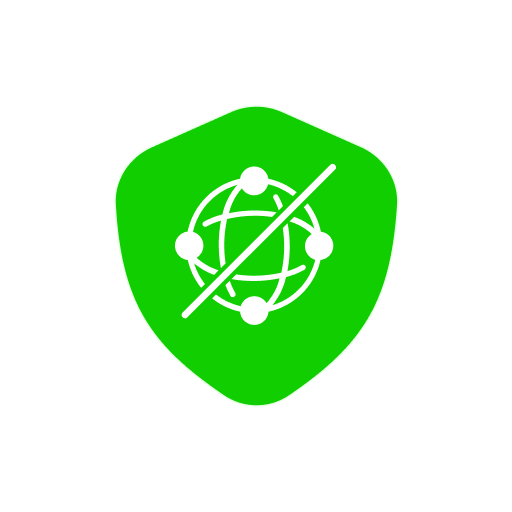
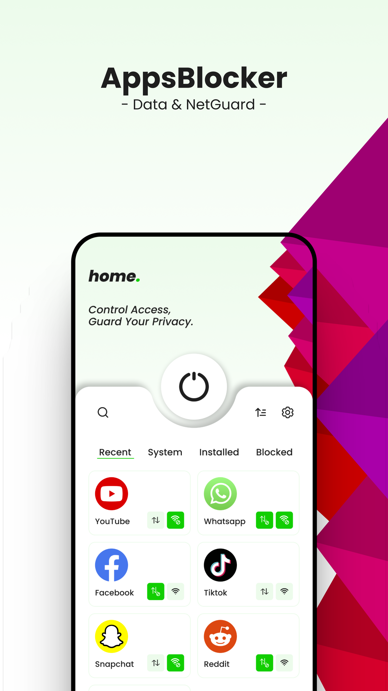
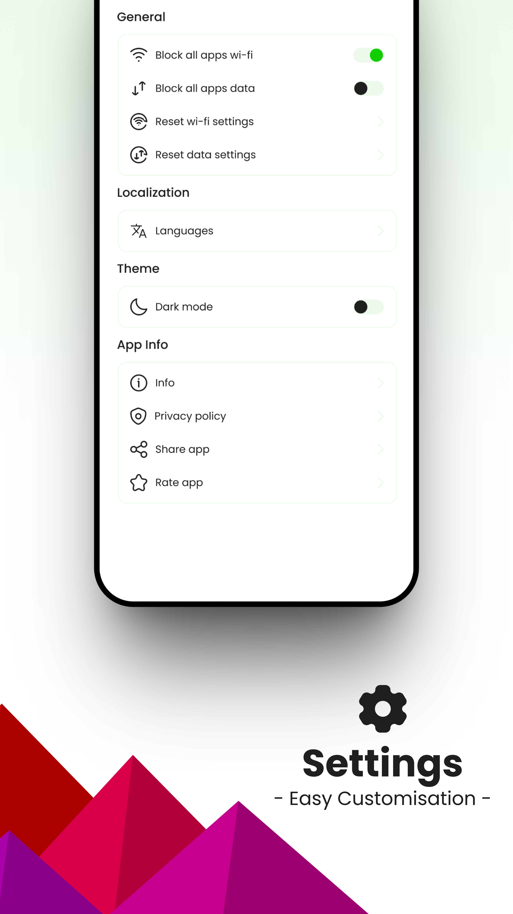
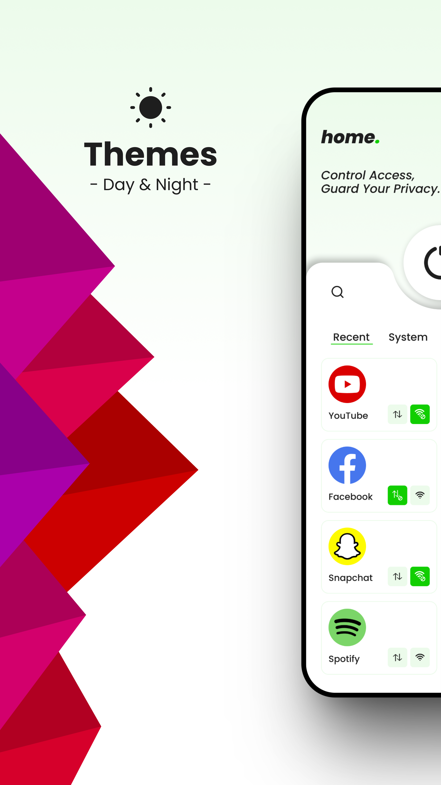
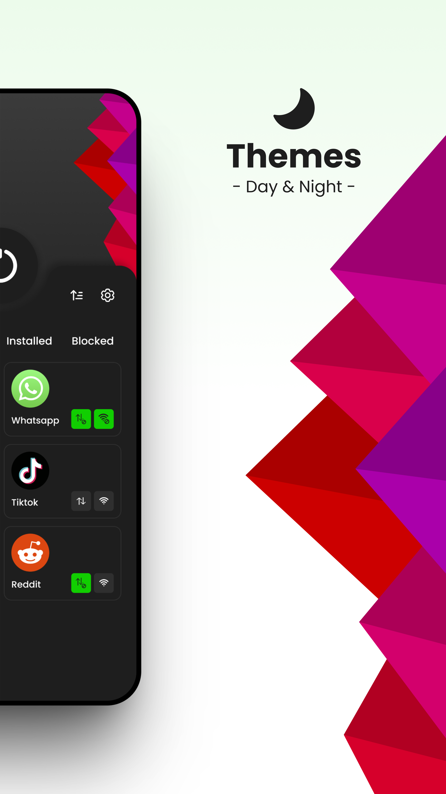
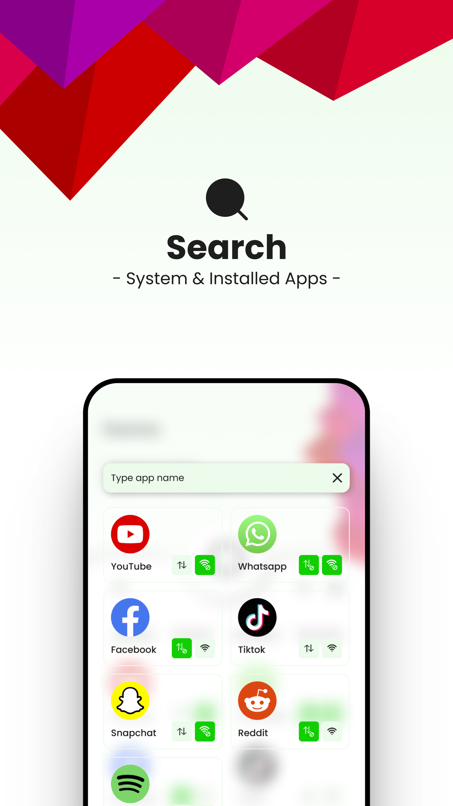

  

# AppsBlocker - Data & Net Guard

## Block apps and sites from unwanted access to control your productivity.

Take back control of your time and digital habits with AppsBlocker – a smart tool to eliminate distractions, enhance focus, and boost productivity. Whether you're working, studying, or simply looking to reduce screen time, AppsBlocker is your go-to solution for managing apps and websites.

## 🚀 Key Features:

- **Efficient blocking of apps and websites**
- **Screen time and usage monitoring**
- **Customizable profiles for various situations**
- **Strict mode to prevent bypassing**
- **Scheduled blocking for better focus**
- **Free & Premium feature options**

## 📈 Why Opt for AppsBlocker?

The digital world is full of distractions – from social media to addictive games. AppsBlocker empowers you to block what matters least, so you can focus on what matters most. Say goodbye to wasted hours and hello to increased productivity, reduced screen time, and improved well-being.

## ⏱ Master Your Digital Time:

With just a few taps, you can block apps or websites that distract you the most. Whether you're trying to study, work, or just unplug, AppsBlocker helps you stay on track.

## 💡 Designed for Focus:

Built with productivity in mind, AppsBlocker is more than just a blocker. It’s a complete digital wellness tool designed by people who understand the struggle of staying focused in a noisy world.

## 🎓 Empowering Students with Focus Tools:

AppsBlocker is an essential tool for students aiming to maximize study sessions and improve academic performance.

- **📚 Tailored Study Sessions**: Customize profiles for a distraction-free environment.
- **🎓 Academic Performance**: Stay focused and boost your grades.
- **🕑 Time Management**: Balance work and relaxation with scheduled blocking.
- **📖 Access Resources**: Browse educational content without unrelated distractions.
- **🧩 Personalized Learning**: Adapt settings to your unique learning style.

## 🖥 Expand to Desktop:

Take your focus to the next level with **AppsBlocker for Google Chrome**. Block distracting sites right from your browser for uninterrupted workflow on your computer.

## 🌟 AppsBlocker Benefits:

- **Boost Productivity**: Optimize your digital environment to support your goals.
- **Better Sleep**: Cut screen time at night and improve your sleep cycle.
- **Digital Wellbeing**: Build healthier habits with reduced distractions.

## 🔒 Privacy Commitment:

We respect your privacy. AppsBlocker operates securely and does not collect personal data. Your focus is your own – and we help you protect it.

Download **AppsBlocker - Data & Net Guard** now and start building a more focused, balanced, and productive life today.

## Featured Image:

  

## Screenshots:

  
  

  
  

  

---

© 2024 AppsBlocker. All rights reserved.
